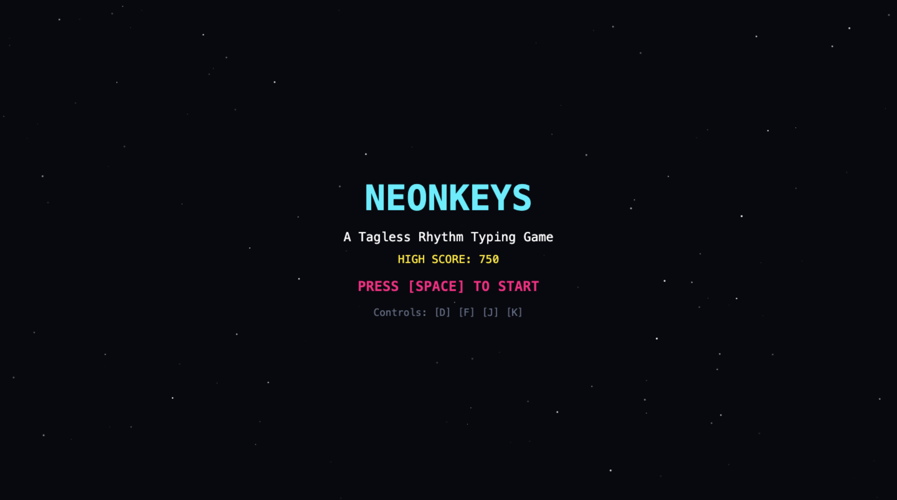
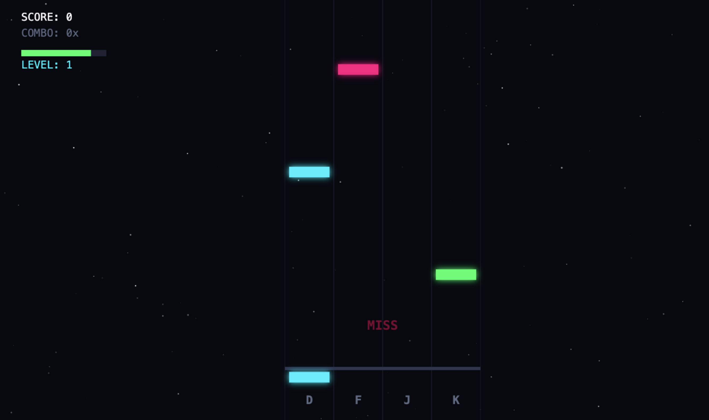
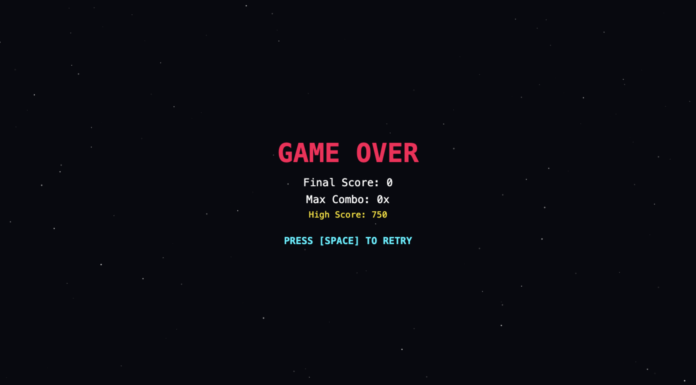

# NeonKeys

A fast-paced retro neon rhythm game played right in the browser.

## Description

I wanted to make a quick keyboard rhythm game inspired by arcade rhythm machines. In NeonKeys, notes drop down four colored lanes to the beat, and you have to tap the keys before they hit the bottom. I built the entire visual display using an HTML5 canvas and wrote the game loop in plain JavaScript without using any heavy game engines. For the sounds, instead of loading big mp3 files, I used the Web Audio API to generate 8-bit synth bleeps on the fly whenever you hit or miss a note. It also tracks your combo streak, health bar, and saves your high score in local storage.

### Tech Stack
- Vanilla JavaScript
- HTML5 Canvas API
- Web Audio API
- Plain CSS

### Screenshots







## Getting Started

### Dependencies
You don't need to install anything special. Any modern web browser like Chrome, Firefox, Edge, or Safari will run it fine.

### Installing
Clone the repository to your computer:
```bash
git clone [https://github.com/itzdeep2/NeonKeys.git](https://github.com/itzdeep2/NeonKeys.git)
cd NeonKeys
